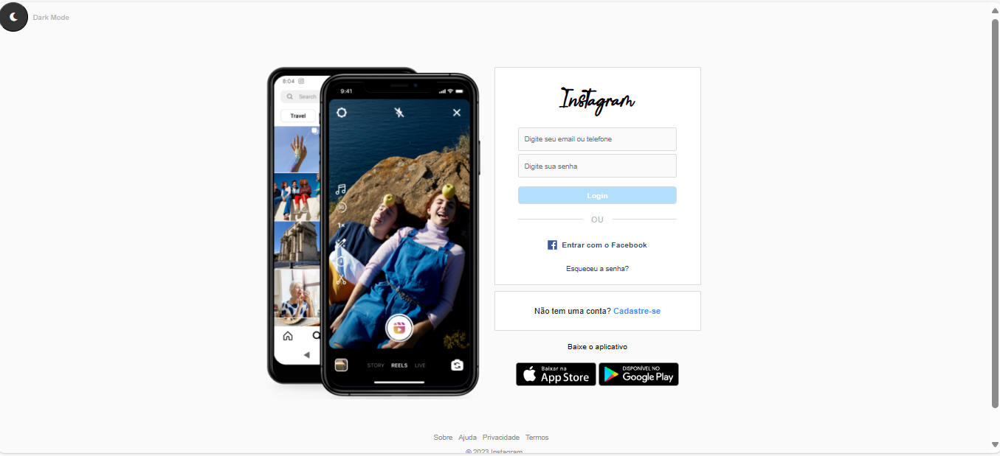

# 🌐 Universo Host - Página de Hospedagem

Este projeto é uma **landing page responsiva** simulando a pagina de login do Instagram.  
O objetivo é praticar **HTML** e **CSS** **JS**, aplicando conceitos de layout, responsividade,estilização moderna e @media.

---

## 📑 Funcionalidades

- **Barra de navegação** com links principais.  
- **Banner principal** com título e slogan.  
- **Seção de login** (verificação de e-mail e senha do usuario).  
- **area para registo** simulada com campo de registro.  
- **Rodapé personalizado** com informações da empresa.  

---

## 🛠️ Tecnologias Utilizadas

- **HTML5** → Estrutura da página.  
- **CSS3** → Estilização, responsividade e design moderno.  
- **Font Awesome** → Ícones visuais. 
- **JavaScript** → para fazer a transição para o modo escuro.
-**Fonte family** → fonte Billabong oficial do instagram.

---

## 📂 Estrutura de Pastas

├── Projeto-Universo-HOST
  ├── js/
    └──script.js    #script da transição para o modo dark.
  ├── fonts/
    └──Billabong.otf   #arquivo da fonte family Billabong.

  ├── css/
    └──styless.css     # estilização da pagina principal.
  ├── html/
     └── index.html    #pagina principal     
  ├── img/                # Imagens do projeto (logo, banner, etc.)

🚀 Como Executar:
1 ° : git clone https://github.com/kafu14/Projeto-Login-Instagram.git  # baixe a pasta do projeto do githuh no seu computador.
2°  : abra a pasta do projeto "Paginalogin-INSTAGRAM.
3° : Abra o arquivo index.html localizado na pasta HTML;

Responsividade

O projeto foi desenvolvido com media queries, garantindo boa visualização em celulares, tablets e desktops.

Prévia do Projeto

📌 Autor

👤 Desenvolvido por Elionilson V. da silva
📧 Email: Elionilson.cafu14@gmail.com

🔗 LinkedIn: www.linkedin.com/in/elionilson-viana-075206326

## Licença

Projeto criado para fins educacionais e de aprendizado. Livre para uso pessoal e acadêmico.